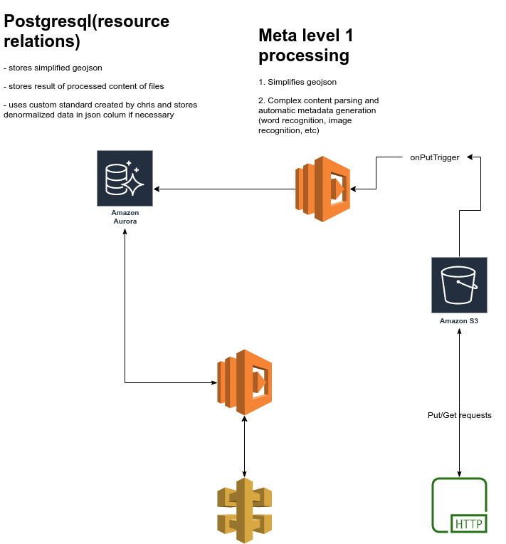

# Architecture Revision 3

Note: This is a proposal for the next revision of the system.

## Goal

The goal of this revision is to allow the querying of the level 1 metadata from s3 buckets in combination with the querying of the level 2 metadata

## Visual representation

## Changes

### MySql to PostgreSQL

This would allow us to store geojson data directly in the resource table. We could also store some amount of unstructured data, though it would not be the goal.

## Resource Table Format

The table format for data from the s3 bucket would be based on the new meta standard being created by chris. Rarer field could be stored in a JSON column

## Advantages

### S3 bucket

#### On put trigger data parsing

Resource creation and modification would trigger one or many lambda functions that would parse the data and produce an easily searchable result. This would allow to do the bulk of the complex querying work in advance and only once.

- GeoJson simplification processing to increase query performance but still keep the original for reference and usage on download
- Image recognition to tag elements contained in image
- Text parsing to understand the subject of files

#### Intelligent tiering

- s3 intelligent tiering will automaticaly sort data between cheap and quick storage locations based on access paterns. Since most data will remain untouched, we could save costs compared to querying the data directly.

### API

#### Querying

Relying entirely on the serverless postgresql database has certain advantages compared to athena

- caching
- simpler queries
- easyer filtering of data before querying the geojson
- the data it queries against can be modified to increase performance or precision
- horizontally scalable

## Disadvantages

- data duplication
- aurora could potentialy be less performant than athena
- if we do end up having to query agains external databases, we will still need to setup athena
