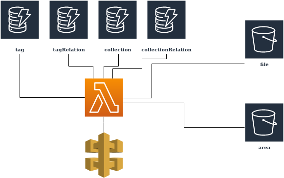

# Tagging System

- [Tagging System](#tagging-system)
  - [Task Description](#task-description)
  - [Design Decisions](#design-decisions)
    - [NoSQL (DynamoDB) vs SQL (MySQL)](#nosql-dynamodb-vs-sql-mysql)
      - [NoSQL](#nosql)
      - [SQL](#sql)
      - [Conclusion](#conclusion)
    - [Allowing Link to External Sources](#allowing-link-to-external-sources)
      - [Advantages](#advantages)
      - [Disadvantages](#disadvantages)
      - [Conclusion](#conclusion-1)
  - [Data structure](#data-structure)
  - [System Architecture](#system-architecture)
    - [Option 1](#option-1)
      - [Advantages](#advantages-1)
      - [Disadvantages](#disadvantages-1)
    - [Option 2](#option-2)
      - [Advantages](#advantages-2)
      - [Disadvantages](#disadvantages-2)
    - [Option 3](#option-3)
      - [Advantages](#advantages-3)
      - [Disadvantages](#disadvantages-3)
      - [Conclusion](#conclusion-2)

## Task Description

As metadata is contributed as an official record of the data we can't alter it in anyway for our own search and discovery purposes. To highlight certain data/services/applications on our web presence, we will need to be able to tag the item with a marker that allows it to be displayed.

This tagging system will enable a second level of metadata to be applied to the actual data by flagging it in a database with a certain tag. These Tags are:

Featured
Foundation Layers
Authoritative Data
Region / Area
Originator / Authority (Government, Public, Academia, etc.)
Indicator (Important for reporting certain socio-economic data)
Emergency Response / Management
and others to be determined.

This system will allow certain items to be displayed dynamically by the tags. For this system to work, it will need to interface with our search engine through lambda. The tags would need to be able to be turned on and off and might be maintained by id / tag combination held within a database such as DynamoDB or a simple MySql instance.

The backend system will be created by the backend team, but how it should work will be a team effort.

## Design Decisions

### NoSQL (DynamoDB) vs SQL (MySQL)

#### NoSQL

* Could use secondary indexes to allow for rapid access to data. However, there is a default maximum of 20 secondary indexes
* It's flexibility is a nice perk as the metadata that we wish to add may change with time
* No need to have a field in each entry for each possible tag

#### SQL

* Would be less reliant on indexes and not hold the soft cap of 20 efficiently searchable fields
* Would potentially offer less performance for simple queries

#### Conclusion

I would recommend going with NoSQL(DynamoDB) for it's flexibility.

### Allowing Link to External Sources

It could be advantageous to allow linking to data not held in Gov of canada's databases. The data could be structure in a way that returns a list of urls that points to a variety of ressource locations. In this case it would be recommended to have the level 2 metadata API be a completely separate system to our database api. This could also allow for the following possibilities:

#### Advantages

* Optional usage of alternative file transfer protocols such as P2P wich could make the system more resilient, reduce operation cost and make it usable by people not properly served by the AWS server's direct download.
* It could allow for direct links to streamed data for when latency needs to be minimized.
* Clear separation of concerns

#### Disadvantages

* Relying on external sources is risky as links may become broken with time. For this the government of canada servers should always be the main serving source for a file.
* The two systems have to be syncronized on ressource creation, deletion, and url change.

#### Conclusion

S/O

## Data structure

```javascript
fileMetadata = {
    name: String,
    description: String,
    keywords: String[],
    featured: Boolean,
    foundationLayers: null, // Please clarify
    authoritativeData: boolean,
    Area: geoJson // (Region),
    authority: String[] // (Government, Public, Academia, etc.),
    indicators: String[],
    emergencyResponse: Boolean,
    licence: String[],
    sources: source[],
    relatedCollections:collection[]
}

source = {
    description: String,
    url: String,
    format: String, // (geoJson, sqlDump, PDF, PNG, Docx, mp4),
    protocol: String // (direct download, data stream, p2p, embeded),
}

collection = {
    title: String,
    description: String,
    content: objectRef[] // (files or collections)
} // (versions, part of set of quarterly reports)
```

## System Architecture

### Option 1



#### Advantages

* Separation of concerns
* Flexible

#### Disadvantages

S/O


### Option 2


#### Advantages

* Minimal number of different systems
* API could query the content of data and not only level 2 metadata

#### Disadvantages

* System could become hard to maintain

### Option 3


#### Advantages

* Flexible
* Clear communication channels
* Efficient filtering of returned data

#### Disadvantages

* Requires multiple different systems

#### Conclusion

It would probably be preferable to go for option 1, as it presents a middle ground between separation of concerns, and minimum superflous systems.