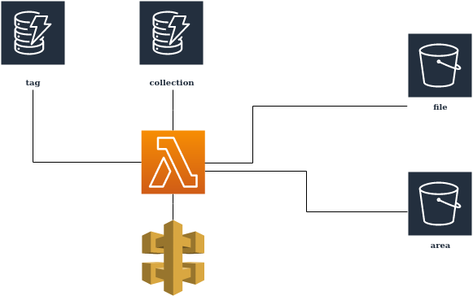

# s3/dynamoDB tagging system

## Issues to take into account

### Storing of location data

s3 metadata fields are limited to 2 KB. Therefore the location data needs to be stored separately to the data. There a two storage options for the location data:

    1. s3
    2. dynamoDB

For this option, the location data will be stored in s3 files.

### Caching

Athena does not cache queries. However, we get an execution ID allows to retrieve the result of previous queries. If we can remember redundant queries and return cached queries we can prevent running expensive requests too often. 

### Tagging system many to many relations

Some tags will be imensly popular compared to others. This will create hight demand for those sections of dynamodb and oversized lists. It may be preferable to rely more strongly on Athena for aggregating tags. But it is uncertain that recuring queries for all items containing certain tags and their synonims would offer better performance or less cost. Especially given the abscence of built in caching for Athena.

## Architecture



### Offering multiple versions of the same file

It may be required to offer multiple formats of the same file. For this need, we could use collections.

Note: Most fields not relevant to the specificaly used by tagging system are intentionally left out.

### S3 Bucket Structure

#### File

```javascript
file = {
    content: File,
    systemMetadata: {
        versionID: String,
    }
    userDefinedMetadata: {
        ...
        geoLocationUrl: String // points to geoLocationBucket entry
        fileFormat: String // this files format ex: csv, png
        alternativeFileFormats: String // collection containing all formats of same file.
        tags: [ String ] // id of tags from dynamo
        collections: [ String ] // id of tags from dynamo
    }
}
```

#### Geo Location

```javascript
file = {
    content: File, // geoLocationData
    systemMetadata: {
        versionID: String,
    }
    userDefinedMetadata: {
        title: String // Ex: Canada
        alternateTitles: [ String ] // Ex: Bas Canada, Haut Canada
        ...
        geoLocation: geoJson // Or desired format
        tags: [ String ] // id of tags from dynamo
        collections: [ String ] // id of tags from dynamo
    }
}
```

### Dynamodb Structure

It is to be noted that tag and collection objects share enought similarities to be merged. This could, however, be undesirable because of the size of the resulting table making certain queries potentially more expensive.

#### Option 1: separate tag and collection

This option offers clear separations of concerns. But may cause redundancy and complexity due to it's similarities with collection.

##### Tag

```javascript
tag = {
    id: String,
    title: String,
    titleAlternatives: [String], // could be other tags and we merge content.
    description: String,
    references: [{
        type: String, // (file, collection, tag or location)
        url: String
        }]
    }
} // (ottawa)
```

##### Collection

```javascript
collection = {
    id: String,
    title: String,
    description: String,
    references: [{
        type: String, // (file, collection, tag or location)
        url: String
        }] // (files or collections)
    tags: [String] //tags table
} // (versions, part of set of quarterly reports)
```

#### Option 2: merge collection and tag

This option could use secondary indexes to access the tag or collection subset quickly.

##### Collection

```javascript
collection = {
    id: String,
    title: String,
    titleAlternatives: [String],
    description: String,
    type: String, // collection or tag
    references: [{
        type: String, // (file, collection, tag or location)
        url: String
        }] // (files or collections)
    tags: [String] //Collection table
} // (versions, part of set of quarterly reports)
```

#### Option 3: split tag and tag relations

* This option prevents the creation of immense lists, but puts more burden on the query maker to find ways of aggregating required data. 
* We could use dictionaries to query for synonims and use secondary indexes to search by tag name. Our buckets would drop any reference to tags.
* We could sort tagRelations with a popularity count. This way when we fetch popular ressources we could limit ourselves to the top x results by popularity for each tag.


##### dynamodb

###### TagRelation

```javascript
tagRelation = {
    id: String,
    referencedtagid: String, // reference to tag from tag table
    popularity: Number, // increments each time we get a click with it as a filter
    reference: {
        url: String, // (file, collection or location url)
        type: String, // (file, collection or location)
    }
} // (ottawa)
```

###### Tag

```javascript
tag = {
    id: String,
    title: String,
    titleAlternatives: [String],
    description: String,
} // (ottawa)
```

###### Collection

```javascript
collection = {
    id: String,
    title: String,
    description: String,
    references: [{
        type: String, // (file, collection, tag or location)
        url: String
        }] // (files or collections)
} // (versions, part of set of quarterly reports)
```