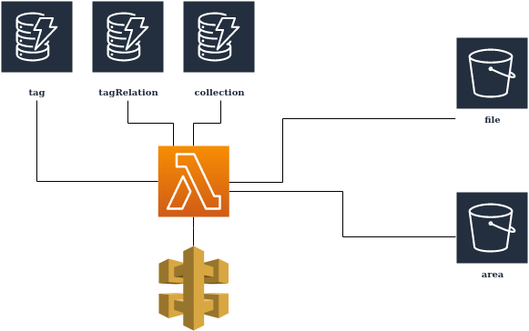

# Tagging System

## Architecture



## Structure

### S3 Bucket Structure

#### File

```javascript
file = {
    content: File,
    systemMetadata: {
        versionID: String,
    }
    userDefinedMetadata: {
        ...
        geoLocationUrl: String, // points to geoLocationBucket entry
        fileFormat: String, // this files format ex: csv, png
        collections: [ String ] // id of collections from dynamo
    }
}
```

#### Geo Location

```javascript
file = {
    content: File, // geoLocationData
    systemMetadata: {
        versionID: String,
    }
    userDefinedMetadata: {
        title: String // Ex: Canada
        alternateTitles: [ String ] // Ex: Bas Canada, Haut Canada
        ...
        geoLocation: geoJson, // Or desired format
    }
}
```

### dynamodb

#### Tag

```javascript
tag = {
    id: String,
    title: String,
    titleAlternatives: [String],
    description: String,
    area: String, // url to area OPTIONAL
} // (ottawa, water)
```

#### TagRelation

```javascript
tagRelation = {
    id: String,
    referenceid: String, // reference to tag from tag table
    popularity: Number, // increments each time we get a click with it as a filter
    reference: {
        url: String, // (file, collection or location url)
        type: String, // (file, collection or location)
    }
}
```

##### Collection

```javascript
collection = {
    id: String,
    title: String,
    description: String,
    area: String, // url to area OPTIONAL
    references: [{
        type: String, // (file, collection, tag or location)
        url: String
        }] // (files or collections)
    tags: [String] //tags table
} // (versions, part of set of quarterly reports)
```